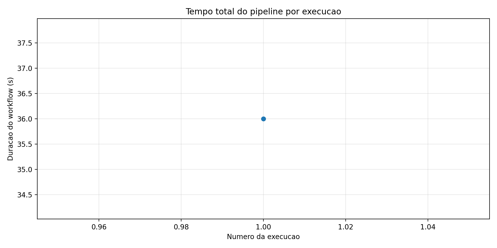
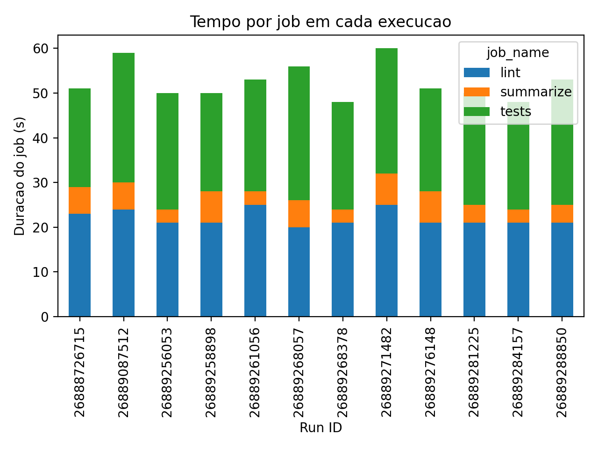
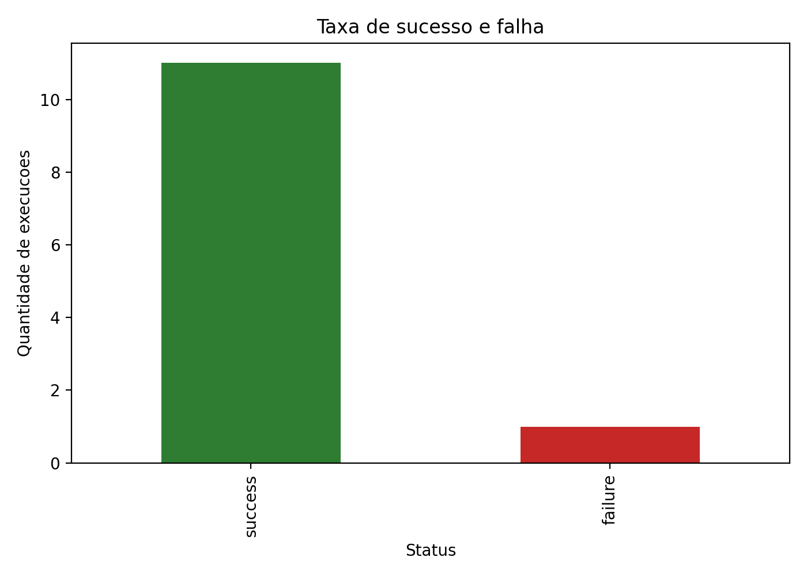
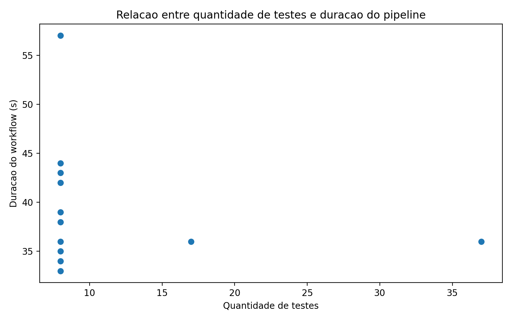

# Experimento de Pipeline CI/CD com GitHub Actions

<p align="center">
  <a href="#visao-geral"></a>
  <a href="#briefing-da-atividade"></a>
  <a href="#stacks-utilizadas"></a>
  <a href="#estrutura-do-repositorio"></a>
  <a href="#roteiro-de-avaliacao"></a>
  <a href="#graficos-anexados"></a>
  <a href="#links-importantes"></a>
</p>

## Visao Geral

Este repositório entrega um experimento prático de instrumentação de pipeline CI/CD com GitHub Actions. O projeto foi construído para atender a atividade pedida: executar um workflow real múltiplas vezes, coletar métricas estruturadas, gerar gráficos e produzir análise crítica sobre desempenho, estabilidade e gargalos.

Resultado atual do experimento:

- 12 execuções controladas reais no GitHub Actions
- 1 pipeline com `lint`, `tests`, artefatos e resumo
- 1 coletor em Python para exportar `CSV` e `JSON`
- 4 gráficos gerados a partir dos dados reais
- 1 relatório técnico consolidado em Markdown

## Briefing Da Atividade

O que a atividade exigia:

- criar ou adaptar um pipeline no GitHub Actions
- incluir instalação de dependências, lint ou análise estática, testes automatizados, artefatos e coleta de métricas
- executar o pipeline pelo menos 12 vezes com variações controladas
- coletar dados reais em formato estruturado
- gerar ao menos 4 gráficos
- responder perguntas analíticas sobre cache, paralelismo, gargalos, falhas e limitações
- entregar repositório, workflow, scripts, base de dados, gráficos, relatório e passos de reprodução

Como este projeto atende:

- workflow principal em [`.github/workflows/ci-experiment.yml`](.github/workflows/ci-experiment.yml)
- coletor em [`scripts/collect_github_actions_metrics.py`](scripts/collect_github_actions_metrics.py)
- base final em [`data/`](data/)
- gráficos em [`artifacts/graphs/`](artifacts/graphs/)
- relatório final em [`reports/technical_report.md`](reports/technical_report.md)

## Stacks Utilizadas

### Aplicação e scripts

- `Python`
- `pytest`
- `pytest-json-report`
- `requests`
- `pandas`
- `matplotlib`
- `ruff`

### CI/CD e automação

- `GitHub Actions`
- `YAML`
- `GitHub CLI (gh)`

### Formatos de dados

- `CSV`
- `JSON`
- `JUnit XML`
- `Markdown`

## Estrutura Do Repositorio

```text
.
├── .github/workflows/
├── artifacts/graphs/
├── ci/
├── data/
├── reports/
├── scripts/
├── src/ci_experiment/
└── tests/
```

### O que existe em cada pasta

- [`.github/workflows/`](.github/workflows/)
  Contém o pipeline `ci-experiment.yml`, com os jobs `lint`, `tests` e `summarize`.

- [`artifacts/graphs/`](artifacts/graphs/)
  Guarda os 4 gráficos finais gerados a partir dos CSVs do experimento.

- [`ci/`](ci/)
  Guarda a configuração controlável do experimento em `experiment_config.json`, usada para variar quantidade de testes, lentidão artificial e falha induzida.

- [`data/`](data/)
  Guarda a base de dados coletada do GitHub Actions:
  `run_metrics.csv`, `job_metrics.csv`, `step_metrics.csv` e `collected_metrics.json`.

- [`reports/`](reports/)
  Guarda o relatório técnico principal da atividade.

- [`scripts/`](scripts/)
  Concentra os scripts do experimento:
  `build_test_metrics.py`, `collect_github_actions_metrics.py` e `generate_graphs.py`.

- [`src/ci_experiment/`](src/ci_experiment/)
  Implementa o código Python mínimo do projeto usado pelos testes.

- [`tests/`](tests/)
  Contém a suíte automatizada e os testes parametrizados para as variações do experimento.

## Como O Pipeline Funciona

1. O job `lint` instala dependências e executa `ruff check .`.
2. O job `tests` instala dependências, executa `pytest`, gera `JUnit XML`, relatório JSON e `test-metrics.json`.
3. O job `summarize` baixa o artefato dos testes e publica um resumo da execução no GitHub Actions.
4. O script de coleta consulta a API do GitHub e transforma execuções reais em base analítica.
5. O script de gráficos consome os CSVs e gera as visualizações finais.

## Roteiro De Avaliacao

Checklist objetivo para quem for corrigir:

- [x] Repositório público com histórico real de commits
- [x] Workflow YAML acessível no GitHub
- [x] 12 execuções reais com `run IDs`
- [x] Variações controladas no código e no workflow
- [x] Script Python autoral de coleta de métricas
- [x] Base estruturada em `CSV` e `JSON`
- [x] Quatro gráficos gerados a partir dos dados coletados
- [x] Relatório técnico com análise crítica
- [x] Links reais das execuções
- [x] Commits reais usados no experimento
- [x] Discussão de resultados inesperados
- [x] Discussão de limitações do experimento

### Roteiro rápido para avaliar o projeto

1. Abrir o repositório e confirmar a presença do workflow.
2. Abrir a aba `Actions` e conferir as execuções listadas no relatório.
3. Conferir os arquivos em `data/` e verificar se refletem execuções reais.
4. Conferir os gráficos em `artifacts/graphs/`.
5. Ler o relatório e validar se as respostas batem com a base coletada.

## Reproducao

### Setup local

```bash
python3 -m pip install --user --break-system-packages -e '.[dev]'
python3 -m pytest
python3 -m ruff check .
```

### Coleta de métricas

```bash
export GITHUB_TOKEN=seu_token
python3 scripts/collect_github_actions_metrics.py \
  --repo tvolcati/gha-ci-cd-pipeline-experiment \
  --workflow ci-experiment.yml \
  --output-dir data
```

### Geração de gráficos

```bash
python3 scripts/generate_graphs.py \
  --run-metrics data/run_metrics.csv \
  --job-metrics data/job_metrics.csv \
  --output-dir artifacts/graphs
```

## Links Importantes

- Repositório: <https://github.com/tvolcati/gha-ci-cd-pipeline-experiment>
- Workflow: <https://github.com/tvolcati/gha-ci-cd-pipeline-experiment/blob/main/.github/workflows/ci-experiment.yml>
- Relatório técnico: [`reports/technical_report.md`](reports/technical_report.md)
- Base de runs: [`data/run_metrics.csv`](data/run_metrics.csv)
- Base de jobs: [`data/job_metrics.csv`](data/job_metrics.csv)
- Gráficos: [`artifacts/graphs/`](artifacts/graphs/)

## Graficos Anexados

### Tempo total do pipeline por execução



### Tempo por job em cada execução



### Taxa de sucesso e falha



### Relação entre quantidade de testes e duração do pipeline



## Entregaveis

- repositório GitHub com histórico real
- workflow YAML
- script de coleta de métricas
- base de dados gerada
- gráficos produzidos
- relatório técnico
- instruções de reprodução
